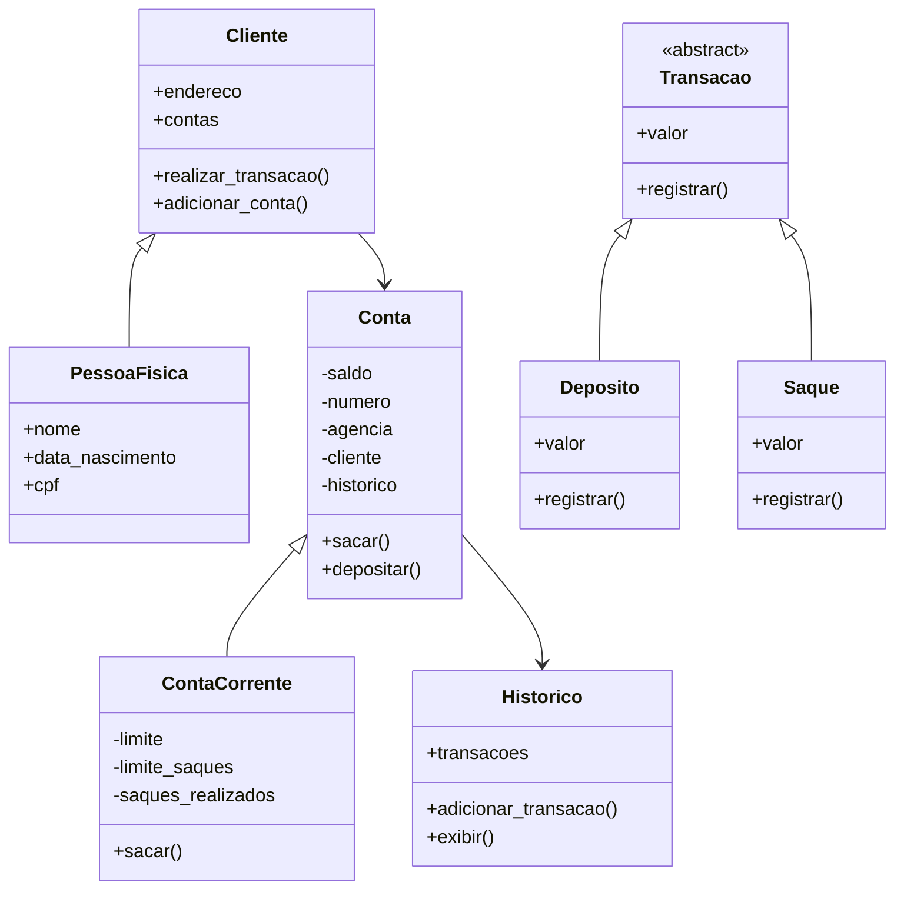

# Desafio: Sistema Bancário em Python V3 (POO)


Na **versão 3**, o sistema bancário foi refatorado para o paradigma de **Programação Orientada a Objetos (POO)**.  
Agora os clientes, contas, transações e histórico são representados como **objetos**, seguindo o modelo de classes UML.

## 💡 Funcionalidades
- **[d] Depositar**: Adicionar valores à conta.  
- **[s] Sacar**: Retirar valores da conta, respeitando saldo, limite de saque e número máximo diário.  
- **[e] Extrato**: Visualizar todas as movimentações e o saldo atual da conta.  
- **[nu] Novo Usuário**: Cadastrar um cliente (objeto `PessoaFisica`).  
- **[nc] Nova Conta**: Criar uma conta corrente (`ContaCorrente`) vinculada a um cliente.  
- **[lc] Listar Contas**: Exibir todas as contas criadas.  
- **[q] Sair**: Encerra o programa.  

## ⚙️ Estrutura em POO
- `Cliente` e `PessoaFisica` → representam os dados dos clientes.  
- `Conta` e `ContaCorrente` → armazenam informações de saldo, limite e vínculo com o cliente.  
- `Historico` → registra todas as transações realizadas.  
- `Transacao` (abstrata), `Deposito` e `Saque` → padronizam e executam operações financeiras.  

## 🛠 Tecnologias Utilizadas
- VSCode  
- Python 3.x  

## 🚀 Como Executar
Clone o repositório, entre no diretório do projeto e execute:

```bash
git clone https://github.com/skynetsites/sistema-bancario-python-v3.git
cd sistema-bancario-python-v3
python sistema_bancario_v3.py
```

## 📌 Exemplo de uso no terminal
```text
=> nu
Informe o CPF (somente números): 12345678900
Informe o nome completo: Isaias Oliveira
Informe a data de nascimento (dd/mm/aaaa): 11/12/1980
Informe o endereço (Logradouro, Número - Bairro - cidade/UF): Rua João e Maria, 123 - Floresta - Fortaleza/CE
Usuário criado com sucesso!

=> nc
CPF do usuário: 12345678900
Conta criada com sucesso!

=> d
Informe o CPF do cliente: 12345678900
Valor do depósito: 1000
Depósito de R$ 1000.00 realizado com sucesso!

=> s
Informe o CPF do cliente: 12345678900
Valor do saque: 200
Saque de R$ 200.00 realizado com sucesso!

=> e
================ EXTRATO ================
Depósito: R$ 1000.00 em 15/09/2025 14:30:10
Saque: R$ 200.00 em 15/09/2025 14:32:05
==========================================
Saldo atual: R$ 800.00
```

## 📊 Diagrama de Classes (UML)



Desafio concluído!
Um projeto prático do curso DIO de Python para você explorar, testar e aprimorar suas habilidades.
